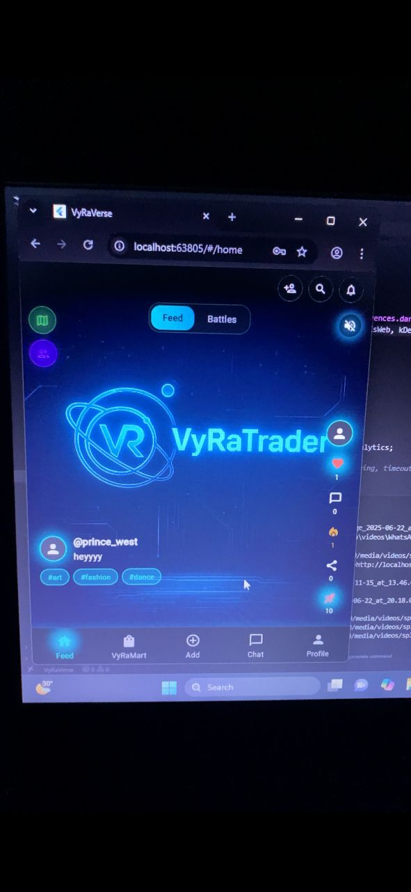
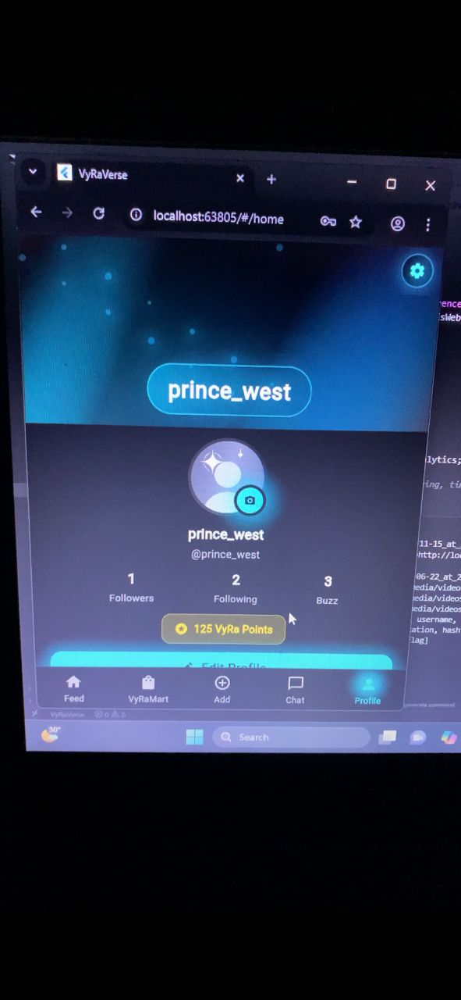
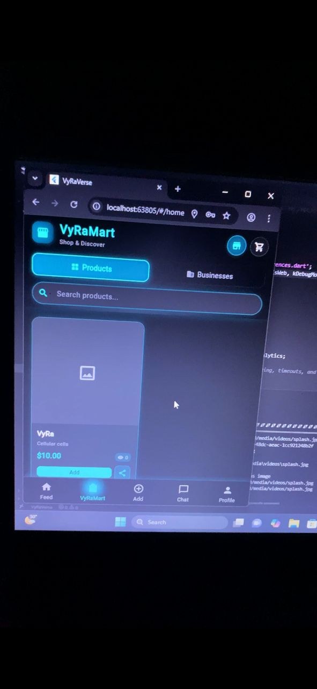

# 🎥 VyRaVerse - Your Creative Social Universe

A comprehensive social media platform combining TikTok-style video sharing, Instagram-like social features, and Snapchat-inspired stories. Includes gamification with VyRa Points, an integrated marketplace, and video battle competitions.

🌐 **Live Demo:** [DEPLOYMENT URL - Add after deploying]



## ✨ Key Features

- 📹 **Vertical Video Feed** - Auto-play feed with advanced camera features (AR filters, beauty mode, effects)
- 🎮 **Gamification System** - Earn VyRa Points for engagement, compete on leaderboards, unlock achievements
- 🛍️ **VyRa Mart** - Integrated e-commerce marketplace for creators and businesses
- ⚔️ **Video Battles** - Side-by-side competitions with community voting
- 💬 **Real-Time Chat** - Direct messaging with read receipts and group conversations
- 📍 **Universe Map** - Discover videos based on location with interactive map
- 🏆 **Challenges & Clubs** - Community features for user engagement
- ⏰ **Ephemeral Stories** - Status updates that disappear after 24 hours
- 🎯 **Boost System** - Increase video visibility using earned points

## 🛠️ Tech Stack

### Backend
- Django 5.2 with Django REST Framework
- PostgreSQL (production ready)
- Token-based authentication
- RESTful API with ViewSets

### Frontend
- Flutter 3.0+ (Dart) for iOS/Android/Web
- Provider pattern for state management
- Custom video player with chewie
- Real-time updates via WebSocket

### Features
- Pillow for image processing
- Video recording with camera package
- Location services with geolocator
- Custom AR filters and effects
- Offline capability with local storage

## 📸 Screenshots





## 🌟 What Makes This Special

- **Combines video-first content with social commerce** - Seamless integration of content creation and e-commerce
- **Unique gamification system with points economy** - Users earn and spend VyRa Points for engagement and boosting
- **Location-based video discovery on interactive map** - Find content near you with the Universe Map feature
- **Full e-commerce integration for creator monetization** - Complete marketplace with business profiles and analytics
- **Advanced camera features with AR effects** - Professional-grade camera with filters, beauty mode, and AR stickers
- **Video battle system for competitive content creation** - Side-by-side video competitions with community voting

## 🏗️ Architecture Highlights

- **Full-stack social media platform from scratch** - Built from the ground up with modern best practices
- **RESTful API with comprehensive endpoints** - Well-structured API covering all platform features
- **Cross-platform mobile and web application** - Single codebase for iOS, Android, and Web
- **Real-time features** - Chat, notifications, and live updates
- **Scalable database design with Django ORM** - Optimized models and relationships
- **Modular frontend architecture** - Clean separation of concerns with services, models, and widgets

## 🎯 Core Systems

### Content Creation
- Video upload from gallery or camera
- Advanced camera features with front/rear switching
- Multiple filter categories (Beauty, Vintage, Artistic, Fun)
- AR effects and stickers
- Duet and Stitch video creation
- Video metadata (hashtags, location, privacy settings)

### Social Engagement
- Like/Comment/Share/Buzz interactions
- Follow system with followers/following lists
- Hashtag system with trending tracking
- Privacy controls (Public, Friends, Private)
- User search and discovery
- Real-time notifications

### Monetization
- VyRa Points economy (earn through engagement)
- Product listings in VyRa Mart
- Business profiles with analytics
- Boost system to increase video visibility
- Transaction history tracking
- Weekly leaderboard rankings

## 📁 Project Structure

```
VyRaVerse/
├── Backend/              # Django REST API
│   ├── core/            # Main app with models, views, serializers
│   ├── VyRa/           # Project settings
│   └── media/          # User-uploaded files
│
└── Frontend/            # Flutter application
    ├── lib/
    │   ├── screens/    # UI screens
    │   ├── services/   # API service layer
    │   ├── models/     # Data models
    │   ├── widgets/    # Reusable components
    │   └── controllers/ # State management
    └── assets/         # Images, sounds, animations
```

## 🔒 Security Features

- Token-based authentication for secure API access
- Privacy settings for videos and profiles
- Content reporting system for moderation
- Secure file upload handling
- Input validation on frontend and backend
- CORS configuration for cross-origin requests

## 📚 Documentation

For detailed technical documentation, see [TECHNICAL_DOCUMENTATION.md](TECHNICAL_DOCUMENTATION.md)

## 💼 Open to Remote Software Development Opportunities

📧 [pjonset@gmail.com] | 💼 [https://www.linkedin.com/in/prince-owusu-gyimah-92052935b?utm_source=share&utm_campaign=share_via&utm_content=profile&utm_medium=ios_app] | 🐙 [https://github.com/prince-west]

---

Built with ❤️ using Flutter and Django

